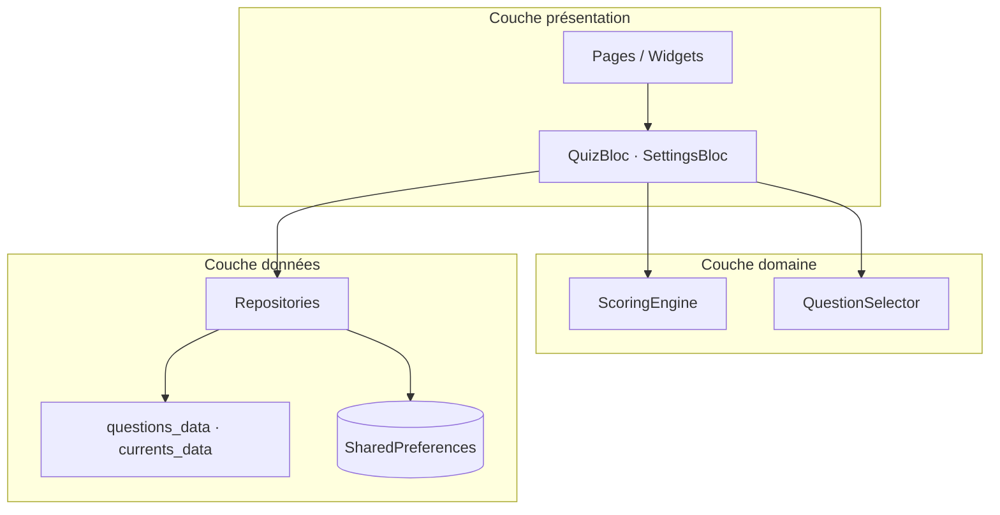

# Boussole Politique

Application mobile **Flutter** éducative et **apartisane** pour explorer ses affinités avec différents courants de pensée politique en France.

> **Ce n’est pas un guide de vote.** L’app mesure des proximités d’idées, pas une identité politique ni une recommandation électorale.

---

## Sommaire

1. [Vue d’ensemble](#vue-densemble)
2. [Stack technique](#stack-technique)
3. [Démarrage rapide](#démarrage-rapide)
4. [Architecture](#architecture)
5. [Structure des dossiers](#structure-des-dossiers)
6. [Navigation et écrans](#navigation-et-écrans)
7. [Flux du quiz et scoring](#flux-du-quiz-et-scoring)
8. [Persistance locale](#persistance-locale)
9. [Publicité (AdMob)](#publicité-admob)
10. [Contenu éditorial](#contenu-éditorial)
11. [Tests](#tests)
12. [Documentation complémentaire](#documentation-complémentaire)

---

## Vue d’ensemble

| Aspect | Choix |
|--------|-------|
| Public cible | 15–25 ans, curieux de politique |
| Données quiz | **100 % locales** (SharedPreferences) |
| Backend | Aucun en V1 |
| État global | BLoC (`QuizBloc`, `SettingsBloc`) |
| Navigation | `go_router` avec shell à 3 onglets |
| Monétisation | AdMob (bannière quiz + interstitiel tous les 25 réponses) |

### Parcours utilisateur

```
Onboarding → Accueil → Cartes (swipe) → Profil d’opinions → Explorer les courants
                ↘ Réglages (méthodo, vie privée, reset)
```

Terminologie UI : **cartes** (activité), **profil d’opinions** (résultat), **affinité estimée** (mesure).

---

## Stack technique

| Package | Rôle |
|---------|------|
| `flutter_bloc` | Gestion d’état (quiz, réglages) |
| `go_router` | Routes déclaratives + shell navigation |
| `equatable` | Égalité des états/événements BLoC |
| `shared_preferences` | Persistance JSON locale |
| `google_fonts` | Typographie (DM Sans) |
| `flutter_animate` | Animations UI (cartes, résultats) |
| `google_mobile_ads` | Bannière + interstitiel AdMob |
| `share_plus` | Partage natif du profil d’opinions |
| `url_launcher` | Liens externes (vie privée) |

**SDK Dart** : `^3.12.2` (voir `pubspec.yaml`).

---

## Démarrage rapide

```bash
# Prérequis : Flutter 3.x installé (https://docs.flutter.dev/get-started/install)

flutter pub get
flutter run          # iOS / Android / simulateur
flutter test         # tests unitaires + widgets
dart analyze         # analyse statique
```

### Build release

```bash
flutter build apk --release
flutter build ios --release   # macOS + Xcode requis
```

---

## Architecture

Organisation **feature-first** : chaque fonctionnalité regroupe UI, logique et modèles. Le code partagé vit dans `core/` et `data/`.



### Injection de dépendances

Tout est câblé dans `lib/app.dart` :

- **Repositories** exposés via `RepositoryProvider` (accès depuis n’importe quel widget avec `context.read<T>()`).
- **BLoCs** exposés via `BlocProvider`.
- **GoRouter** créé une fois au démarrage, avec redirect onboarding.

Point d’entrée : `lib/main.dart` → `BoussoleApp`.

---

## Structure des dossiers

```
lib/
├── main.dart                 # Bootstrap : orientation, prefs, ads, runApp
├── app.dart                  # DI, thème, router, BLoCs racine
│
├── core/                     # Transversal (pas de logique métier quiz)
│   ├── ads/                  # AdMob : config, service, bannière adaptative
│   ├── constants/            # Seuils scoring, clés prefs, nom app
│   ├── extensions/           # Helpers BuildContext (textTheme, etc.)
│   ├── routing/              # GoRouter + MainShell (navbar tricolore)
│   ├── theme/                # Couleurs, typo, ThemeData
│   ├── utils/                # Haptiques
│   └── widgets/              # GradientScaffold, PageHeader, MainShell…
│
├── data/                     # Contenu statique embarqué
│   ├── questions/            # ~58 affirmations + impacts
│   ├── political_currents/   # ~20 fiches courants
│   └── sources/              # Sources éducatives partagées
│
└── features/
    ├── home/                 # Accueil + CTA quiz
    ├── onboarding/           # 3 slides intro
    ├── quiz/                 # Cœur métier
    │   ├── bloc/             # QuizBloc (état machine)
    │   ├── domain/           # ScoringEngine, QuestionSelector
    │   ├── models/           # Question, AnswerValue, dimensions
    │   ├── repositories/     # Questions + progression
    │   ├── view/             # QuizPage
    │   └── widgets/          # SwipeCard, AnswerButtons
    ├── results/              # Page résultats + graphiques
    ├── political_currents/   # Explorer + fiche courant
    ├── methodology/          # Transparence calcul
    ├── about/                # Mission / impartialité
    ├── privacy/              # RGPD + pubs
    └── settings/             # Préférences + reset données
```

---

## Navigation et écrans

Définition : `lib/core/routing/app_router.dart`.

| Route | Écran | Dans la navbar ? |
|-------|-------|------------------|
| `/onboarding` | Intro 3 slides | Non (redirect si pas fait) |
| `/` | Accueil | Oui (onglet 1) |
| `/explore` | Liste des courants | Oui (onglet 2) |
| `/settings` | Réglages | Oui (onglet 3) |
| `/quiz` | Cartes swipe | Non (plein écran) |
| `/results` | Profil d’opinions | Non |
| `/current/:id` | Fiche courant | Non |
| `/methodology` | Méthodologie | Non |
| `/about` | À propos | Non |
| `/privacy` | Vie privée | Non |

La **navbar** (`MainShell`) est **collée au rebord bas** : bandeau tricolore **bleu · blanc · rouge** (drapeau français), icônes au-dessus de l’encoche système.

### Pertinence des pages (revue contenu)

| Page | Rôle | Notes |
|------|------|-------|
| **Accueil** | Hub : cartes + explorer + méthodo | CTA principal dans le hero |
| **Explorer** | Encyclopédie des courants + affinité estimée | Bandeau si pas encore de profil |
| **Cartes** | Interaction principale | Swipe coins + boutons |
| **Profil d’opinions** | Visualisation résultats | Hémicycle, radar, révélation rapide |
| **Fiche courant** | Détail pédagogique | Idées, limites, sources |
| **Méthodologie** | Transparence scoring | Accueil, résultats, réglages |
| **À propos** | Mission, public, impartialité | |
| **Vie privée** | Local-first + AdMob + lien Google | Obligatoire stores |
| **Réglages** | Haptics, intro, liens info, données | |
| **Onboarding** | Gestes + neutralité | 1× au lancement, rejouable |

---

## Flux du quiz et scoring

### 1. Sélection des questions

`QuestionSelector` choisit la prochaine carte en privilégiant les catégories/dimensions peu couvertes et un mélange intro / approfondissement.

### 2. Réponses utilisateur

| Valeur | Score | Geste |
|--------|-------|-------|
| Super oui | +2 | Coin haut droit |
| Oui | +1 | Coin bas droit |
| Passer | 0 | Bas centre |
| Non | −1 | Coin bas gauche |
| Super non | −2 | Coin haut gauche |

### 3. Calcul des affinités

`ScoringEngine` (`lib/features/quiz/domain/scoring_engine.dart`) :

1. Pour chaque réponse (hors « passer »), additionne `score × weight` par courant.
2. Normalise en pourcentage 0–100 % par rapport au score max théorique.
3. Calcule les dimensions (radar) et l’hémicycle (position abstraite).
4. Identifie les réponses les plus influentes.

Formule : `percent = ((rawScore / maxPossible) + 1) × 50` → clamp 0..100.

Seuils (`AppConstants`) : 12 réponses (aperçu), 30 (profil fiable), 55 % dimensions couvertes.

### 4. États du QuizBloc

```
initial → loading → active ⇄ processing → completed
                      ↓                      ↓
               viewingResults ← ResultsRequested
```

---

## Persistance locale

| Clé SharedPreferences | Contenu |
|-----------------------|---------|
| `quiz_progress_v1` | Réponses + flag completed |
| `onboarding_done_v1` | Onboarding terminé |
| `haptics_enabled_v1` | Vibrations |
| `swipe_tip_v1` | Aide swipe |
| `theme_mode_v1` | Thème (`system` / `light` / `dark`) |

**Aucune réponse n’est envoyée sur un serveur.**

---

## Publicité (AdMob)

| Format | Emplacement | Fréquence |
|--------|-------------|-----------|
| Bannière | Bas du quiz | Permanente sur `/quiz` |
| Interstitiel | Plein écran | Toutes les **25** réponses |
| Cooldown | — | 2 min |

En dev : `USE_TEST_ADS=true` (défaut) via `--dart-define` dans `lib/core/ads/ad_config.dart`.

Détails : [`docs/MONETISATION.md`](docs/MONETISATION.md).

---

## Contenu éditorial

- Questions : `lib/data/questions/questions_data.dart`
- Courants : `lib/data/political_currents/currents_data.dart`

Guide : [`lib/data/README.md`](lib/data/README.md).

---

## Tests

```bash
flutter test
```

- `test/scoring/scoring_engine_test.dart`
- `test/quiz/quiz_bloc_test.dart`
- `test/widgets/quiz_widgets_test.dart`

---

## Principes produit

1. **Apartisan** — jamais « tu es de gauche/droite ».
2. **Affinités d’idées** — pourcentages = proximité, pas identité.
3. **Local-first** — quiz sensible, pas de cloud en V1.
4. **Pédagogique** — hémicycle = métaphore, pas carte officielle.
5. **Transparence** — méthodologie accessible.

Projet privé (`publish_to: 'none'`).
